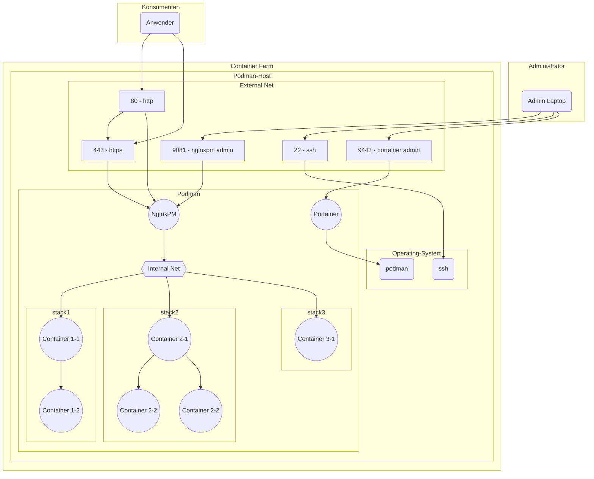

```mermaid
flowchart TD
    subgraph admin["Administrator"]
        admin_net("Admin Laptop")
    end
    
    subgraph consumer["Konsumenten"]
        user("Anwender")
    end

    user-->port_80
    user-->port_443
    port_80-->port_443
    admin_net-->port_9081
    admin_net-->port_22
    admin_net-->port_9443

    subgraph CN-DC["Container Farm"]
        
        
        subgraph Podman-Host
            subgraph Operating-System
                ssh("ssh")
                podman("podman")
            end
            
            subgraph External Net
                port_22["22 - ssh"]
                port_80["80 - http"]
                port_443["443 - https"]
                port_9081["9081 - nginxpm admin"]
                port_9443["9443 - portainer admin"]
            end

            subgraph Podman
                portainer((Portainer))
                nginxpm((NginxPM))
                net_intern{{Internal Net}}

                subgraph stack1
                    container1_1(("Container 1-1"))
                    container1_2(("Container 1-2"))
                end

                subgraph stack2
                    container2_1(("Container 2-1"))
                    container2_2(("Container 2-2"))
                    container2_3(("Container 2-2"))
                end

                subgraph stack3
                    container3_1(("Container 3-1"))
                end

                portainer-->podman
            end
        end

        port_9443-->portainer
        port_9081-->nginxpm
        port_80-->nginxpm
        port_443-->nginxpm
        port_22-->ssh

        nginxpm-->net_intern
        net_intern-->container1_1
        container1_1-->container1_2
        
        net_intern-->container2_1
        container2_1-->container2_2
        container2_1-->container2_3
        
        net_intern-->container3_1

    end
```