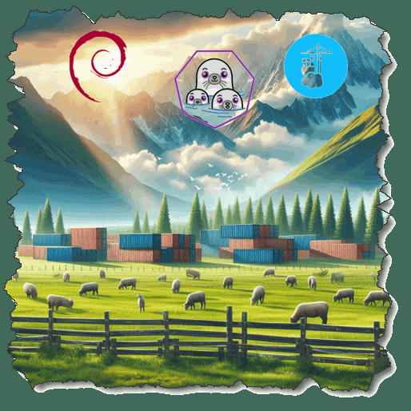
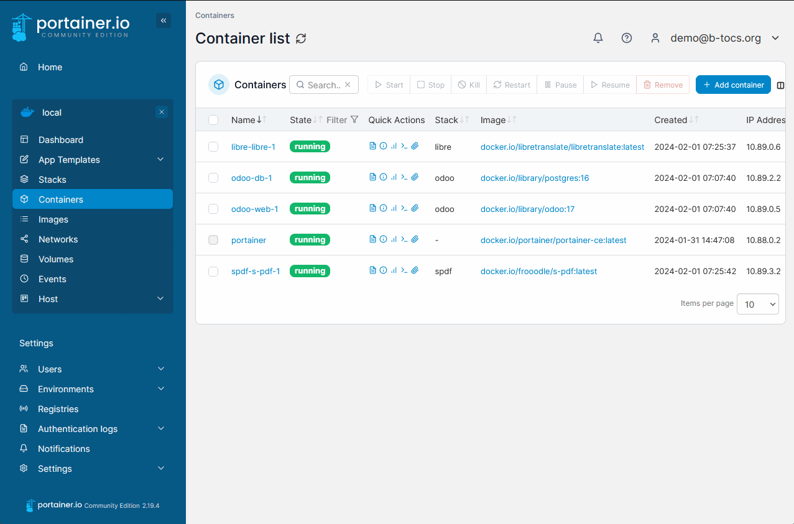
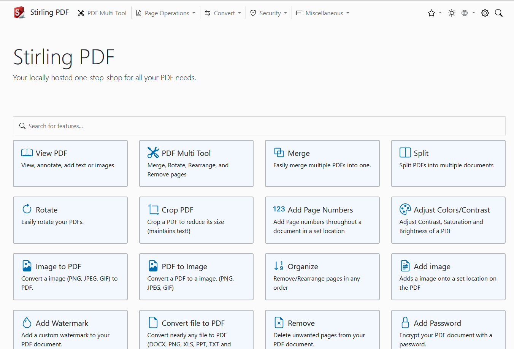
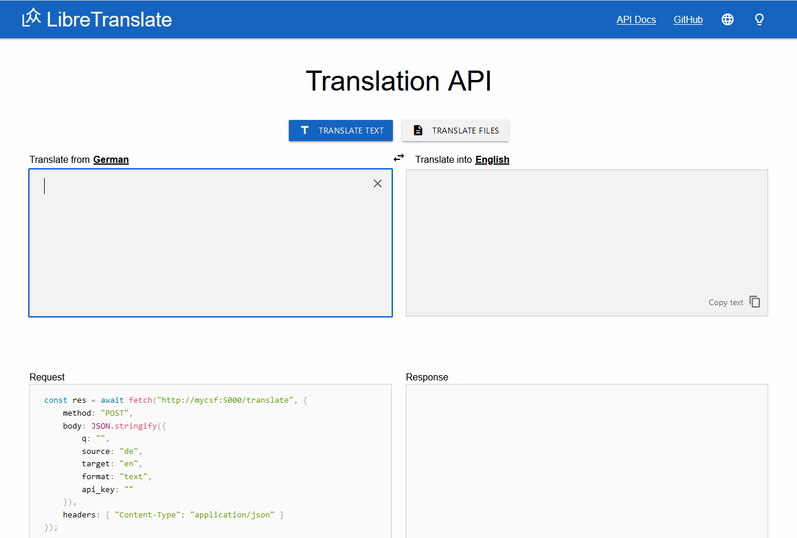
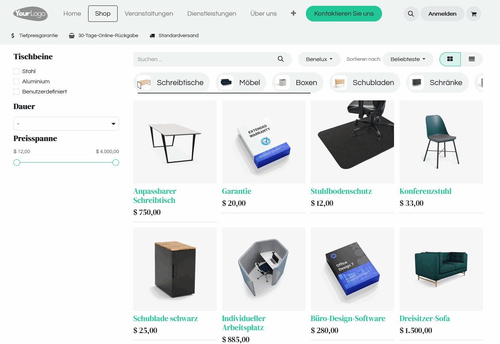
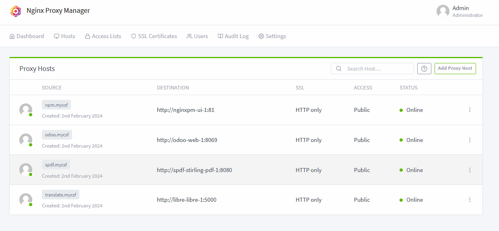
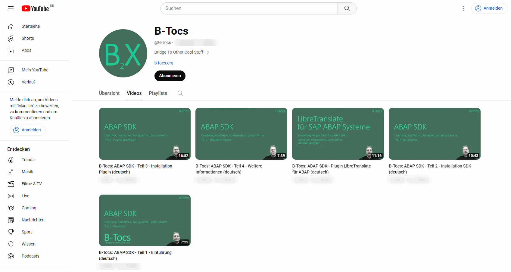
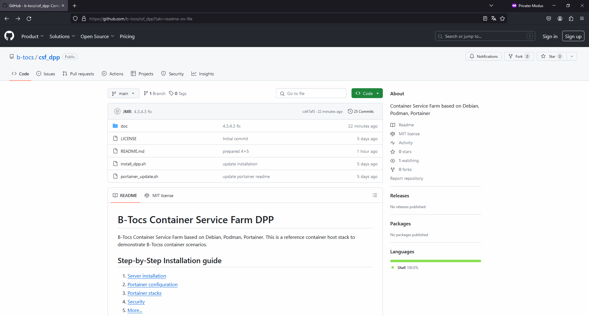

# Container Service Farm
#### Videoreihe DPP - Debian, Podman, Portainer 

#### Überblick

---
# Container Service Farm
#### Videoreihe DPP - Debian, Podman, Portainer 
Inhalt:
1. Installation
2. Einführung Portainer
3. Container Stacks
4. Security Themen
5. Weitere Hinweise

---
# Portainer

- WebUI für Container Management 
- Zielgruppe: Privatanwender, Business
- https://www.portainer.io

---
# Stirling-PDF

- Web Toolbox für die PDF Bearbeitung
- Zielgruppe: Privatanwender, Business
- kann über API auch als WebService verwendet werden
- stirlingtools.com 

---
# LibreTranslate

- Online Übersetzer für Texte und Dateien
- kann selbst betrieben werden und setzt KI ein
- Zielgruppe: Privatanwender, Business
- WebService verfügbar
- de.libretranslate.com

---
# Odoo

- Open Source ERP mit Webseite, Online Shop u.a.
- kann selbst betrieben werden 
- Zielgruppe: Unternehmen, Vereine
- www.odoo.com/de_DE

---
# Nginx Proxy Manager

- Reverse Proxy für Zugriff über Namensauflösung
- HTTPS und SSL Zertifikate
- Zielgruppe: Unternehmen, Privatpersonen
- nginxproxymanager.com

---
# Youtube Kanal

Youtube Kanal: `https://www.youtube.com/@B-Tocs`

---
# Github Informationen

Github Repository öffnen: `https://github.com/b-tocs/csf_dpp`

---
# Wir sehen uns!

