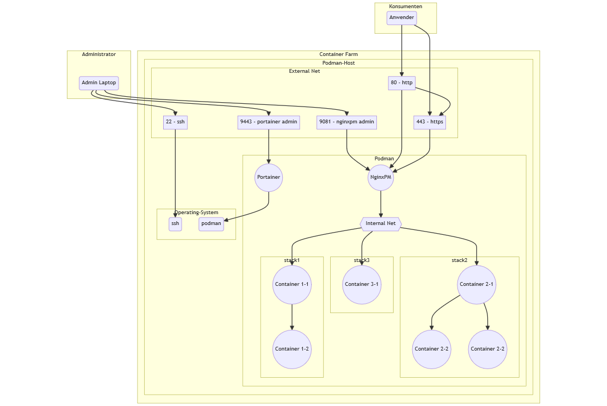
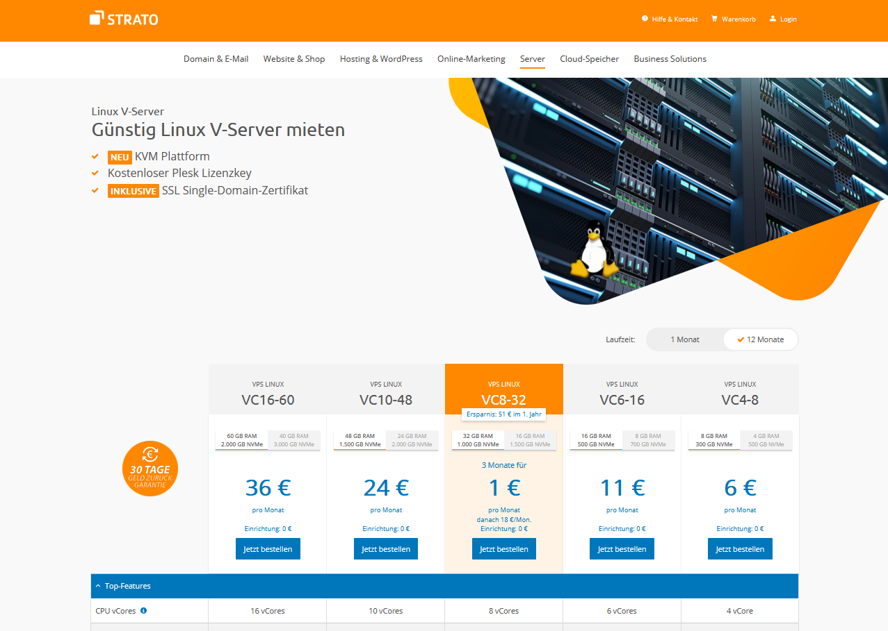
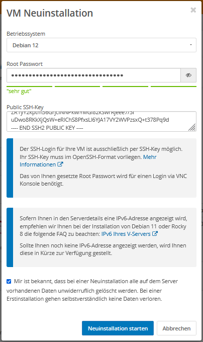
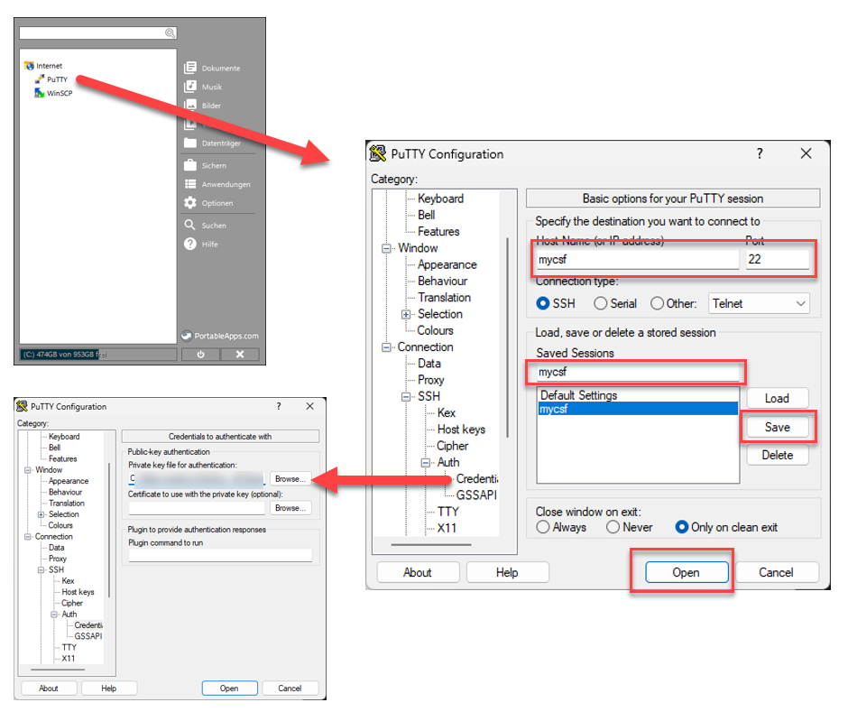
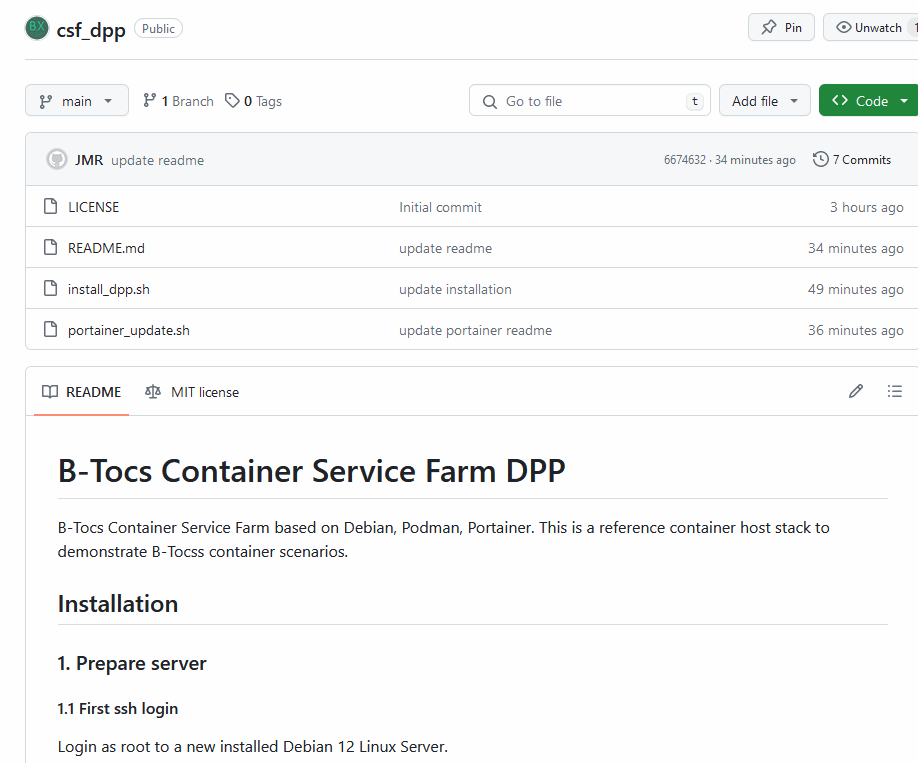

# Container Service Farm
#### Videoreihe DPP - Debian, Podman, Portainer 

#### Teil 1 - Installation

---
# Container Service Farm
#### Videoreihe DPP - Debian, Podman, Portainer 
Inhalt:
1. **Installation**
2. Einführung Portainer
3. Container Stacks
4. Security Themen
5. Weitere Hinweise

---
# Teil 1 - Installation
#### CSF1: DPP - Debian, Podman, Portainer  

Inhalt:
- Überblick
- Serverauswahl
- Installation Debian 12
- Installation Podman + Portainer

---
# Überblick

---
# Serverauswahl

Kriterien:
- Eigenes RZ vs. Hoster
- Internet vs. nur intern
- hier verwendet: Strato Linux V-Server
- Strato ist hier kein Sponsor!

---
# Debian 12

- Strato installiert Debian nicht als Vorschlag
- Daher Neuinstallation nötig - Kundenportal
- Sicheres root-Passwort verwenden > 20 Zeichen
- SSH-Login mit RSA Key, wenn möglich

---
# Erster Login

- SSH Client benötigt
- Empfehlung PortableApps.com und PuTTY
- SSH Login mit Public Key - siehe Bild 

---
# Installation

- Github Repository öffnen: `https://github.com/b-tocs/csf_dpp`
- Schritte unter 1 abarbeiten

---
# Geschafft!

Aktueller Stand:
- Server konfiguriert
- Portainer ist einsatzbereit
- Backup, Update und Reboot wurde getestet

Nächster Schritt:
- Einführung Portainer

