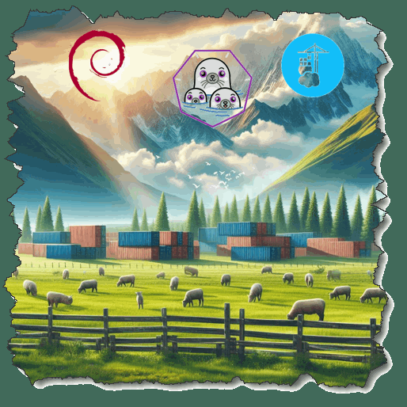
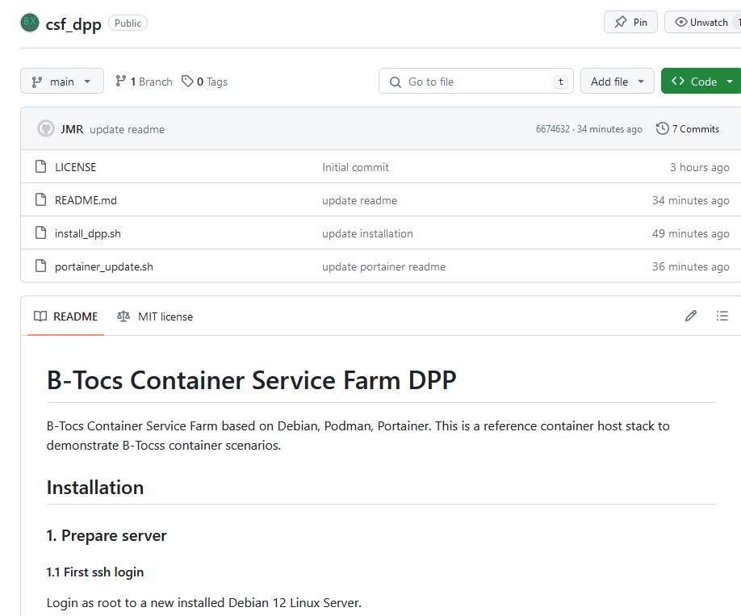

# Container Service Farm
#### Videoreihe DPP - Debian, Podman, Portainer 

#### Teil 2 - Einführung Portainer

---
# Container Service Farm
#### Videoreihe DPP - Debian, Podman, Portainer 
Inhalt:
1. Installation
2. **Einführung Portainer**
3. Container Stacks
4. Security Themen
5. Weitere Hinweise

---
# Teil 2 - Einführung Portainer
#### CSF1: DPP - Debian, Podman, Portainer  

Inhalt:
- Erstes Login
- Portainer UI
- Volumes, Networks, Images
- Container laden und starten
- Backup, Update

---
# Portainer 

---
# Überblick

---
# Installation

- Github Repository öffnen: `https://github.com/b-tocs/csf_dpp`
- Schritte unter 2 abarbeiten

---
# Geschafft!

Aktueller Stand:
- Portainer ist konfiguriert
- Ein erster Container läuft

Nächster Schritt:
- Portainer Stacks

