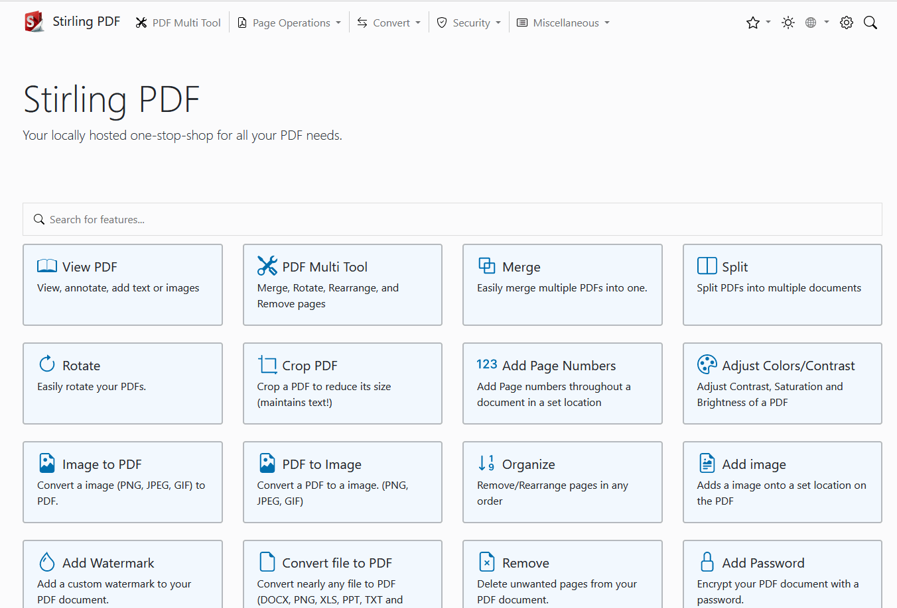
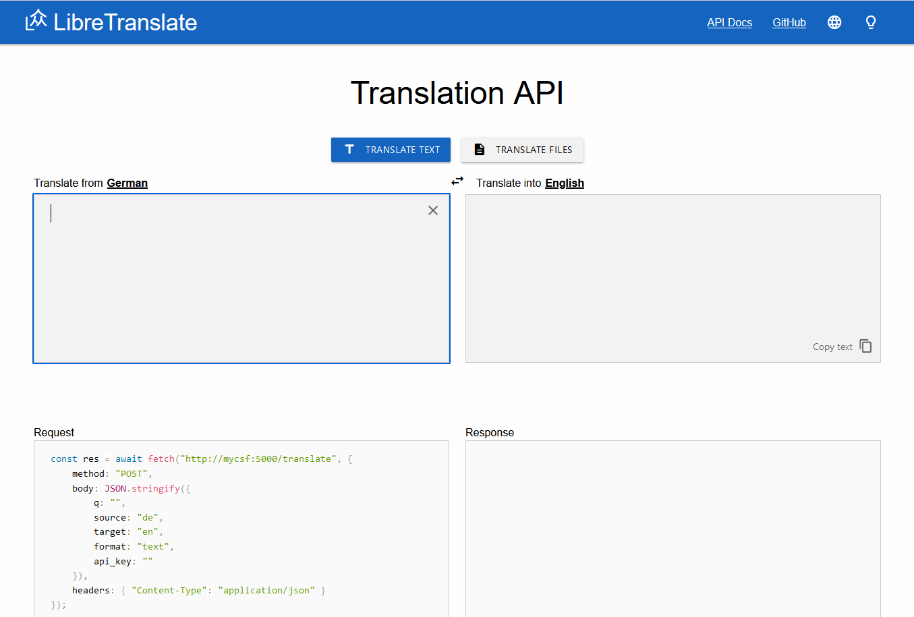
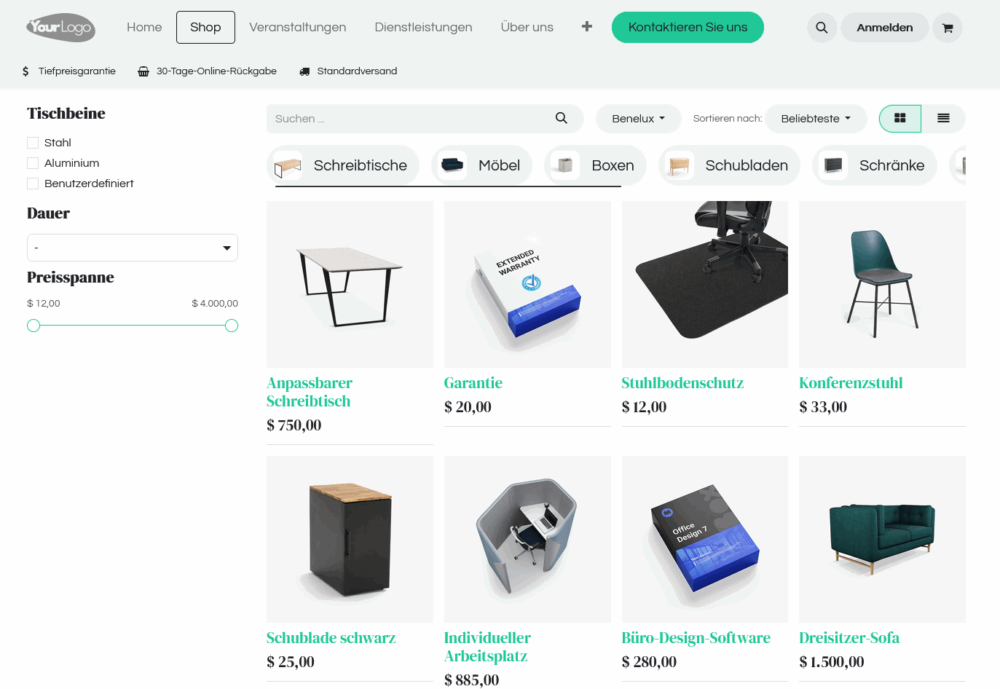
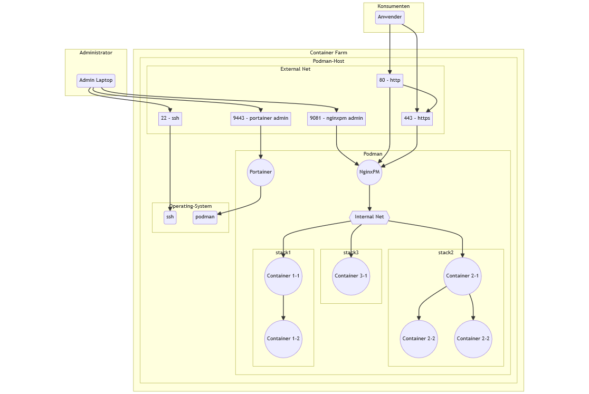

# Container Service Farm
#### Videoreihe DPP - Debian, Podman, Portainer 

#### Teil 3 - Container Stacks

---
# Container Service Farm
#### Videoreihe DPP - Debian, Podman, Portainer 
Inhalt:
1. Installation
2. Einführung Portainer
3. **Container Stacks**
4. Security Themen
5. Weitere Hinweise

---
# Teil 3 - Container Stacks
#### CSF1: DPP - Debian, Podman, Portainer  

Inhalt:
- Stacks statt Container
- Port-Konflikte
- Einfacher Stack - Stirling-PDF
- Stack mit Volumes - LibreTranslate
- Stack mit mehreren Containern - Odoo

---
# Stirling-PDF

- Web Toolbox für die PDF Bearbeitung
- Zielgruppe: Privatanwender, Business
- kann über API auch als WebService verwendet werden
- stirlingtools.com 

---
# LibreTranslate

- Online Übersetzer für Texte und Dateien
- kann selbst betrieben werden und setzt KI ein
- Zielgruppe: Privatanwender, Business
- WebService verfügbar
- de.libretranslate.com

---
# Odoo

- Open Source ERP mit Webseite, Online Shop u.a.
- kann selbst betrieben werden 
- Zielgruppe: Unternehmen, Vereine
- de.libretranslate.com

---
# Überblick

---
# Installation

- Github Repository öffnen: `https://github.com/b-tocs/csf_dpp`
- Schritte unter 3 abarbeiten

---
# Geschafft!

Aktueller Stand:
- die Container Farm läuft
- verschiedene Anwendungen laufen
- Portainer-Funktionen wurden gezeigt

Nächster Schritt:
- Security-Themen

