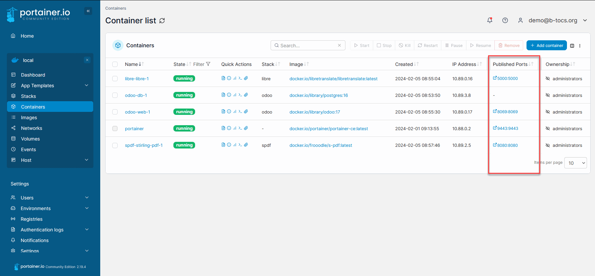
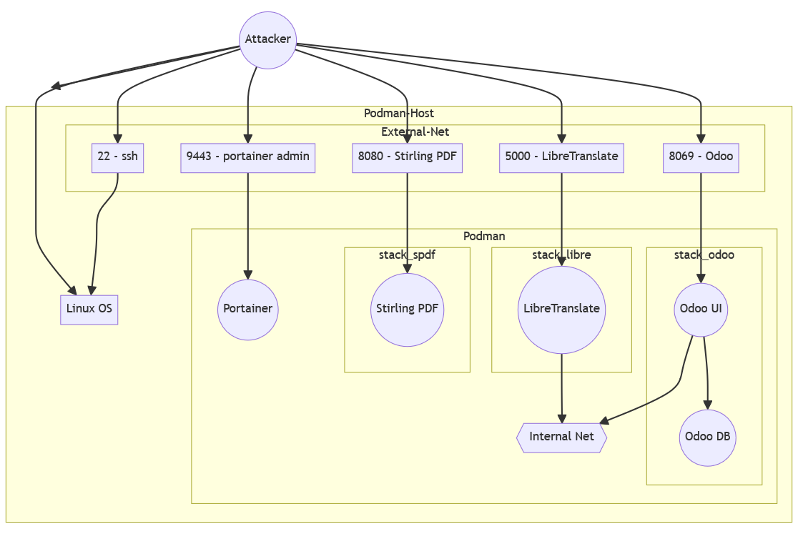

# Container Service Farm
#### Videoreihe DPP - Debian, Podman, Portainer 

#### Teil 4 - Security

---
# Container Service Farm
#### Videoreihe DPP - Debian, Podman, Portainer 
Inhalt:
1. Installation
2. Einführung Portainer
3. Container Stacks
4. **Security Themen**
5. Weitere Hinweise

---
# Teil 4 - Security
#### CSF1: DPP - Debian, Podman, Portainer  

Inhalt:
- Grundsätzliches
- Stack Ports deaktivieren
- Reverse Proxy mit NginxPM
- Zugriffslisten
- HTTPS/SSL

---
# Aktuell offene Ports

---
# Angreifersicht

---
# Installation

- Github Repository öffnen: `https://github.com/b-tocs/csf_dpp`
- Schritte unter 4 abarbeiten

---
# Teil 4 - Security
#### CSF1: DPP - Debian, Podman, Portainer  

Weitere Maßnahmen:
- Podman rootless
- Sudo Benutzer statt root
- SSH mit Public Key statt Passwörter
- Interne und externe Firewalls
- Alternative Stacks (statt DPP)...

---
# Geschafft!

Aktueller Stand:
- die Container Farm wurde abgesichert
- Neue Anwendungen können sicher konfiguriert werden

Nächster Schritt:
- Weitere Informationen

