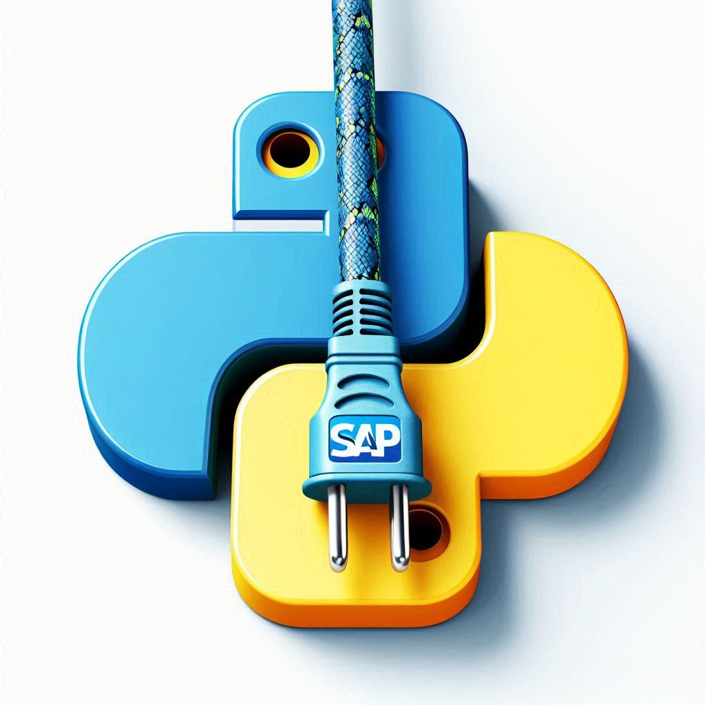

# Python SDK 
### Python API 4 ABAP 
Videoreihe p4a1

- A - Python API Service
- B - ABAP Konsument
- C - Container Deployment

---

# Python SDK 
### Python API 4 ABAP 
Videoreihe p4a1

#### A - Python API Service
- Installation
- Projekt erstellen
- openAPI Test

---

# Python SDK 
### Python API 4 ABAP 
Videoreihe p4a1

#### B - ABAP Konsument
- RFC Destination
- Demo Reports
- Debugging

---

# Python SDK 
### Python API 4 ABAP 
Videoreihe p4a1

#### C - Container Deployment
- Lokaler Container
- Container registrieren
- Container verwenden

